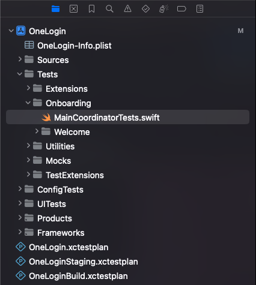
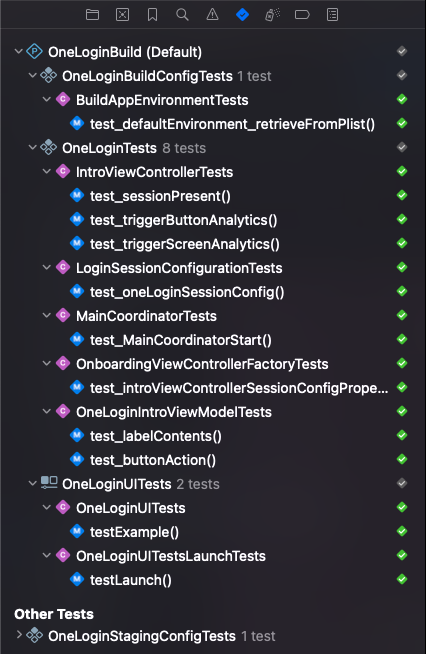

# How To - Running the tests

## Introduction

This guide shows you how to run both the Unit and UI tests for an iOS app.

## Where are the tests?

The Unit and UI tests are located under the `Tests` and `UITests` folders respectively, found on the left hand side in the project directory in Xcode:

## How to run the tests

To run all the tests together, click and hold the play button in the top left of the toolbar and select `Test`. Xcode will automatically build and run all tests.

Individual tests can be run by going to the desired test file and clicking the button to the left of the test definition - this can test a whole class, extension or one specific test:

## Test results

Navigating to the test icon in the left-hand window of Xcode (at the top of the project directory, there's a mini-toolbar. The test icon will look like the test icon used to run the tests):

Test outcomes will be displayed here, and also in the corresponding test files:

